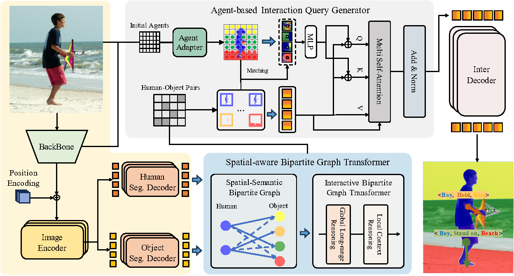
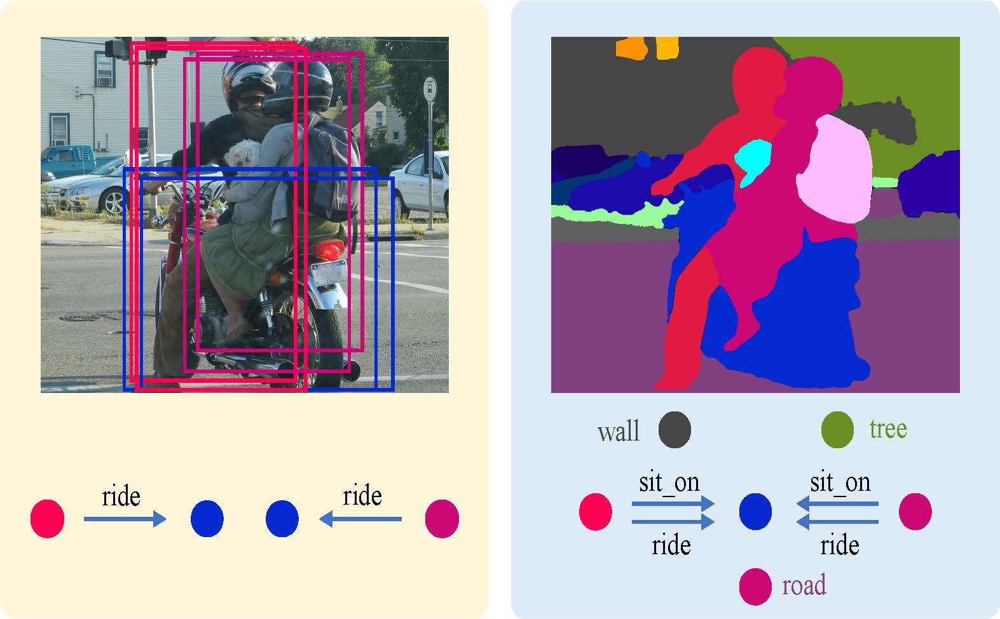
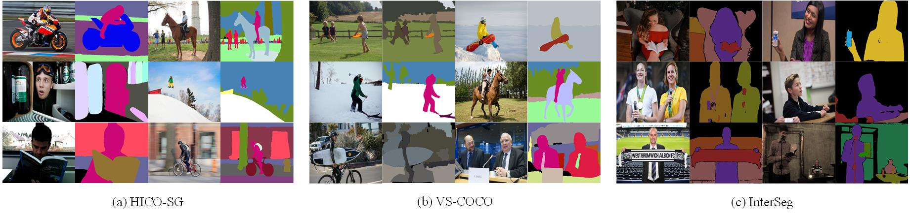
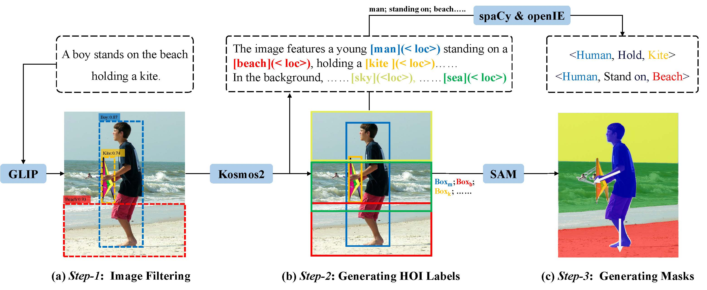

# Ag-BiGT 

An implementation code for paper "Beyond Boxes: Towards SHOI with Interactive Graph Reasoning and Agent-Based Query Learning"


## Table of Contents

- [Background](#background)
- [Datasets](#datasets)
- [Dependency](#dependency)
- [Usage](#usage)
- [Acknowledgments](#acknowledgments)


## Background

Human-object interaction (HOI) detection extends beyond the localization of humans and objects in images to identify the interactions between them. Existing approaches predominantly frame the HOI task as a detection problem, emphasizing the identification of human and object-bounding boxes alongside their interactions. However, we argue that this bounding-box-based paradigm is inherently limited in achieving fine-grained HOI detection due to its coarse localization. In this work, we focus on a more fine-grained case of the HOI: Segmentation-grounded Human-object Interaction (SHOI) detection. This new task shifts the focus from coarse bounding boxes to pixel-level masks, enabling more precise human-object interaction recognition. First, we introduce three benchmark datasets—VS-COCO, HICO-SG, and InterSeg to build the benchmark of SHOI and establish a comprehensive benchmark including a number of two-stage and one-stage models, systematically evaluating their effectiveness in SHOI detection. Furthermore, we introduce a novel baseline model, Ag-BiGT, agent-based query with bipartite graph-transformer.  Specifically, we first leverage a bipartite graph transformer to refine the human and object nodes by long-range and local context reasoning modules. Subsequently, we exploit multiple agents to generate spare-aware interaction queries integrated with the human-object pairs. Extensive experiments on both SHOI and HOI tasks demonstrate our proposed Ag-BiGT is superior to other state-of-the-art HOI models on a suite of SHOI and HOI datasets.  

<p align='center'>  
  
</p>

<p align='center'>  
  <em>Overview of the Ag-BiGT model for pixel-level Segmentation-grounded Human-object Interaction detection.  The model consists of two main components: (1) an interactive bipartite graph transformer, which models both local and long-range dependencies by learning spatial and semantic relationships between human and object nodes, effectively distinguishing between interactive and non-interactive pairs, and (2) an agent-based interaction query generator for producing adaptive queries tailored to diverse human-object interactions.
</em>
</p>

## Datasets
SHOI detection shares the same goal as HOI detection, also aiming to predict a set of interaction triples, but the only difference lies in the form of localization for humans and objects. More concretely, SHOI   emphasizes generated detailed and nuanced masks for each instance instead of the conventional coarse bounding boxes.

<p align='center'>  
  
</p>

Human-object Interaction (HOI) detection vs. Segmentation-grounded Human-Object Interaction (SHOI) detection.  (Left) illustrates an examplefrom the HICO-DET dataset. (Right) showcases the corresponding masks from our curated HICO-SG dataset. The conventional HOI task localizes humans and objects via bounding boxes involving irrelevant pixels. Our proposed SHOI task defines a more fine-grained and cleaner HOI representation with more accurate localizations of objects.


We present construct three SHOI datasets, including HICO-SG, VS-COCO and InterSeg

<p align='center'>  
  
</p>

#### Automated Construction of SHOI Dataset using Pipeline
In this study, we introduce a novel approach for the automated creation of Spatial Human-Object-Interaction (SHOI) datasets.  Our method leverages segmentation models in conjunction with multimodal large-scale models within a cohesive pipeline.  This pipeline facilitates the seamless generation of SHOI datasets, thereby streamlining the data acquisition process.
#### Enhancement of Existing and Widely Used HOI Datasets
Furthermore, we contribute to the advancement of the field by enhancing existing and widely adopted Human-Object-Interaction (HOI) datasets.  Through careful curation and augmentation techniques, we improve the quality and diversity of the dataset, addressing potential limitations present in conventional datasets.  


<p align='center'>  
  
</p>

## Dependency

### Environment Setup
We recommend using Anaconda to set up the environment:

``` bash
conda install pytorch==1.13.1 torchvision pytorch-cuda=11.7 -c pytorch -c nvidia -y
yes | pip install mmcv-full==1.7.0 -f https://download.openmmlab.com/mmcv/dist/cu117/torch1.13/index.html
conda install scipy -c conda-forge -y
yes | pip install mmcls==0.23.2
yes | pip install mmdet==2.25.1
yes | pip install git+https://github.com/facebookresearch/detectron2.git
yes | pip install wandb
```
### Data Preparation
The resulting directory structure should be as follows:

``` bash
├── configs
├── data
│   ├── VS-COCO
│   │   ├── annotations
|   │   │   ├── panoptic_train2017
|   │   │   ├── panoptic_val2017
│   │   ├── train2017
│   │   └── val2017
│   │   └── VS-COCO.json
│   ├── ...
├── pretrain
├── agbigt
├── scripts
├── tools
│   ├── train.py
│   ├── test.py
├── work_dirs
├── ...
```

## Usage

### Training

```bash
#single GPU
PYTHONPATH='.':$PYTHONPATH python configs/mask2former/agbigt.py

#multi GPU
PYTHONPATH='.':$PYTHONPATH bash tools/dist_train.sh configs/mask2former/agbigt.py 4
```

### Testing

```bash
PYTHONPATH='.':$PYTHONPATH \
python tools/test.py \
    configs/deformable_detr/od_r101_coco.py \
    pretrain/deformable_detr_r101_coco.pth \
```

## Acknowledgments

Ag-BiGT is developed based on [MMDetection](https://github.com/open-mmlab/mmdetection) and [STIP](https://github.com/zyong812/STIP). We sincerely appreciate the efforts of the developers from the previous codebase.

